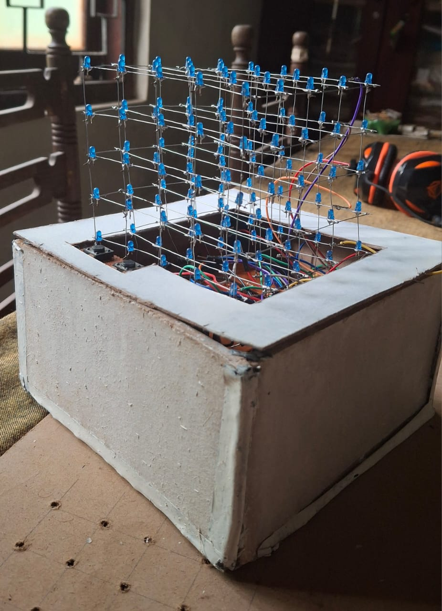

# 3D LED Cube 

## 📌 Project Overview
This project implements a **5x5x5 LED Cube** powered by an **ATmega328p microcontroller** to play a simplified **Space Invasion game**.  
The cube consists of **125 individually addressable LEDs**, controlled using multiplexing with **decoders, transistors, and hex inverters**.  

🎮 **Gameplay:**  
- A "ship" represented by a 3x5 LED grid moves up and down via two pushbuttons.  
- Random barriers approach from the opposite face of the cube.  
- The player must dodge barriers to survive as long as possible.  

This project demonstrates the integration of **hardware design, PCB implementation, and embedded software programming** in a creative interactive system.

---

## ⚙️ Hardware Components
Key components used:
- ATmega328p Microcontroller  
- 125 × 3mm LEDs  
- 4 × CD74HCT238 (3-to-8 Decoders)  
- 4 × 74LS04 Hex Inverters  
- 25 × 2N2907A Transistors  
- 5 × IRFZ44N MOSFETs  
- 2 × Pushbuttons  
- 5V, 1A Power Adapter  
- Resistors, headers, PCB boards, and supporting components  

---

## 🔧 Software Description
- **Multiplexing** technique used to address 125 LEDs with only 11 microcontroller pins.  
- **PORTC and PORTD** pins configured as outputs for column and layer selection.  
- **Debounce function** implemented for reliable button inputs.  
- **Random LED generation** simulates barriers approaching the ship.  
- **Game logic** checks collisions between barriers and the ship.  

---

## ▶️ Usage
1. Compile the code (`main.c` and `led_cube.h`) using **AVR-GCC** or an IDE like **Atmel Studio**.  
2. Upload the hex file to the **ATmega328p** using a programmer (e.g., USBasp).  
3. Connect the cube, schematic-driven PCB, and pushbuttons.  
4. Power the cube with a **5V / 1A adapter**.  
5. Play the game by moving the ship **up/down** using the buttons to dodge barriers.  

---

## 📊 Results & Limitations
- The cube successfully displayed the **ship and barriers** and responded to button inputs.  
- Some issues occurred during PCB assembly (shorts and dimly lit LEDs).  
- Future iterations can improve PCB design with **larger pad clearance** and **better soldering practices**.  

---

## 🔮 Future Improvements
- Improve PCB layout for reliability.  
- Use higher brightness LEDs for better visibility in bright conditions.  
- Extend the game logic with scoring and difficulty levels.  
- Explore larger LED cubes (e.g., 8x8x8).  

---

## 📖 Reference
See the full project documentation:  
📄 **s16102_Final_Project_Report.pdf**

